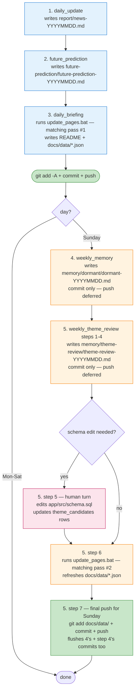

# Future Prediction App

Backend that ingests the daily `report/news-YYYYMMDD.md` + `future-prediction/future-prediction-YYYYMMDD.md` files into a local SQLite DB, scores theme activity over 7d / 30d / 90d windows, and writes the static JSON artifacts the GitHub Pages dashboard under `../docs/` consumes.

## Scheduled flow

Daily flow runs Mon-Sun (1 → 2 → 3). On Sunday only, 4 and 5 chain after 3. There is no return to 3 after 5; the flow runs left-to-right exactly once per day. 3 and 5 are deliberately independent and complementary — each runs `update_pages.bat` (matching pass), so even without schema edits in 5, today's dashboard reflects today's news AND the latest schema by end of Sunday.



Specs live in `../design/scheduled/*.md`. Each task is self-contained — no cross-references between scheduled docs (Cowork loads each independently). All include a Step 0 lock-recovery preflight to handle stale `.git/index.lock` before any git operation.

## Layout

```
app/
  src/
    cli.py                  # `python -m src.cli <init|ingest|score|export|update>`
    db.py                   # sqlite connect + schema bootstrap
    schema.sql              # DB schema (copied from design/)
    ingest.py               # parsers -> DB + LCS/semantic fuzzy matcher
    score.py                # per-theme / per-category aggregation
    export.py               # DB -> docs/data/{manifest,graph-*}.json
    parsers/
      news_parser.py        # extracts predictions from report/news-*.md
      prediction_parser.py  # extracts validation rows from future-prediction/*.md
    analytics/
      scoring.py            # pure formulas (attention / realization / grass_level)
      windows.py            # 7d / 30d / 90d ranges + helpers
  tests/                    # pytest suite
  data/
    analytics.sqlite        # generated, gitignored
  update_pages.bat          # Windows daily-update entry (callable from Claude Cowork)
  update_pages.sh           # POSIX equivalent
  pyproject.toml
```

## Daily update

From the repo root:

```bat
app\update_pages.bat
```

The script runs `python -m src.cli update`, which:

1. Parses every `report/news-*.md` and `future-prediction/future-prediction-*.md`.
2. Upserts source files, predictions, validation rows, evidence items, prediction<->evidence links.
3. Assigns each prediction a primary theme via IDF-weighted keyword match; placeholder orphans go to `theme_candidates`.
4. Recomputes `topic_daily_activity` and `category_daily_activity` for 7d / 30d / 90d.
5. Takes per-prediction realization snapshots.
6. Writes `docs/data/manifest.json`, `graph-tech.json`, `graph-business.json`, `graph-mix.json` (served by GitHub Pages from `/docs`).

## Commands

```bash
python -m src.cli init        # bootstrap DB from src/schema.sql + seeds (idempotent)
python -m src.cli ingest      # parse markdown + upsert rows
python -m src.cli score       # compute daily activity for all windows
python -m src.cli export      # write docs/data/*.json
python -m src.cli update      # ingest + score + export (used by update_pages.bat)
```

## Scoring model (see `analytics/scoring.py`)

Per-window aggregation for a theme or category:

```text
new_signal        = min(1, Σ (relevance_normalized for new evidence)       / 3.0)
continuing_signal = min(1, Σ (relevance_normalized for continuing evidence) / 5.0)
attention_score   = min(1, new_signal + 0.5 * continuing_signal)           # PRD §6.4

realization_score = 0.65 * mean(new_rel) + 0.35 * mean(cont_rel)           # PRD §6.5
grass_level       = 0/1/2/3/4 by attention breakpoints 0.05/0.25/0.5/0.75   # PRD §6.6
status            = new / active / continuing / dormant                    # (predictions: supported / weakly_supported / no_signal)
```

Notes:

- **Contradiction axis is retired**. Unrealized predictions just score low on realization; a separate signal was near-always zero and didn't earn its screen real estate. `contradiction_score` stays in the bundle at `0.0` for schema compatibility.
- **Frequency matters**: each normalized relevance (1–5 → 0.2..1.0) *sums* into the signal before the cap, so three relevance-5 hits read stronger than one.
- **Daily activity strip** is emitted as `metrics_by_window.<w>.grass_daily = [{date, grass_level, attention_score}]` rolled up from `prediction_evidence_links.validation_date`. The frontend renders one cell per day of the selected window.

## Fuzzy matching (validation row → prediction)

The future-prediction tables re-type each prediction's summary every day (often with minor wording drift), so ingest has to resolve those rows back to the original prediction_id. Two-stage:

1. **Fast path** — normalized longest-common-substring ratio. NFKC, strip markdown/punctuation, lowercase, then `SequenceMatcher(autojunk=False)` to find the longest shared substring. Matches if the shared run is ≥ 12 chars, or LCS / len(shorter) ≥ 0.55.
2. **Semantic fallback** — if phase 1 misses, and `fastembed` is installed, compare multilingual MiniLM embeddings by cosine (threshold 0.75). Fully local, CPU via ONNX Runtime. Model cache: `~/.cache/fastembed/`.

If `fastembed` isn't installed, the pipeline silently stays in LCS-only mode. Install with:

```bash
python -m pip install --user fastembed
```

## Export details worth knowing

- **No empty themes**: every seeded theme is guaranteed at least one child prediction via a force-attachment step. Themes that nothing primarily matches get the single best IDF-scoring prediction as a secondary parent.
- **1:N prediction → theme**: each prediction carries additional secondary parent themes (IDF-scored ≥ 0.55 × best). When these secondaries span more than one category, `shares_prediction` links are emitted between those categories and the involved categories are promoted to always-visible on the graph.
- **MIX graph** (`graph-mix.json`): post-processed union of tech + business. Predictions are de-duplicated by id with their parent_ids merged; cross-scope `shares_prediction` bridges are regenerated so a prediction that straddles tech and business categories pulls both scopes together.
- **Validation reports list**: each prediction node carries `detail.validation_reports = [{date, path}, …]` so the frontend can show "N in 7d / M total" plus the most recent three links.

## Tests

```bash
cd app
python -m pytest -q
```

21 tests — parsers, scoring math, end-to-end ingest+score+export against the real markdown.
